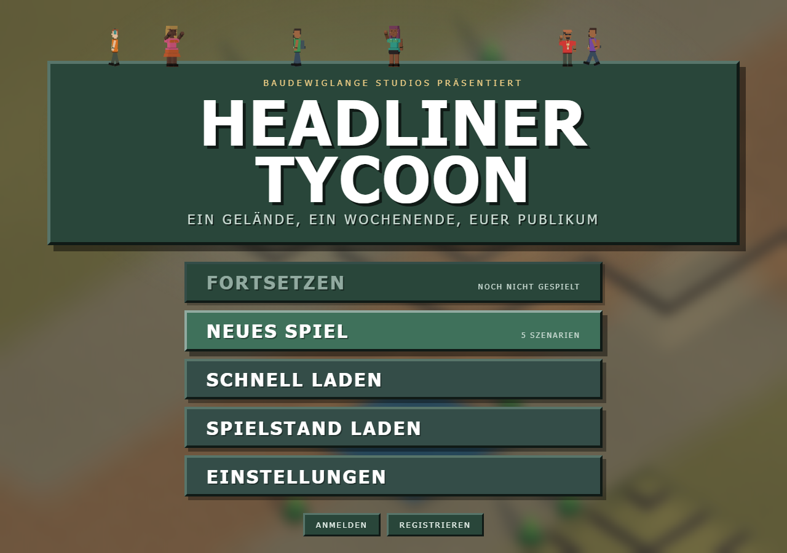

# Headliner Tycoon

Spielbare technische Basis für ein isometrisches Aufbau- und Wirtschaftsspiel mit Node.js, TypeScript und Three.js.



## Start

Unten links werden die Spielversion aus `package.json` und die beim Build erzeugte
UTC-Buildkennung angezeigt. Die Kennung bleibt im ausgelieferten JavaScript fest,
damit auch ältere geladene Clients eindeutig erkennbar sind. Im Entwicklungsmodus
wird sie beim Start des Dev-Servers erzeugt.

Bei künftigen Änderungen die Projektversion erhöhen (für Fehlerkorrekturen:
`npm version patch --no-git-tag-version`). Dabei werden `package.json` und
`package-lock.json` gemeinsam aktualisiert. Jeder Build erhält zusätzlich automatisch
eine neue Zeitkennung.

```bash
npm install
npm run dev
```

Produktions-Build:

```bash
npm run build
npm run preview
```

## Docker und öffentliche Builds

GitHub Actions baut bei jedem Push auf `master` das Spiel und stellt es öffentlich bereit:

- **Release:** https://github.com/y1zz1y/festival-tycoon/releases/latest (`festival-tycoon-web.zip`)
- **Actions-Artefakt:** Workflow-Lauf *Build* → `festival-tycoon-web`
- **Container:** `ghcr.io/y1zz1y/festival-tycoon:latest`

Lokal spielen (HTTP auf Port 8080, inkl. Mehrspieler). Spielstände liegen im Docker-Volume `festival-saves` und bleiben nach Image-Updates erhalten:

```bash
docker pull ghcr.io/y1zz1y/festival-tycoon:latest
docker run --rm -p 8080:8080 -v festival-saves:/app/saves ghcr.io/y1zz1y/festival-tycoon:latest
```

Oder aus dem Repo: `docker compose up --build`. Danach http://localhost:8080 öffnen.

Für Entwickler: Das Image enthält nur `server/` und `dist/` (kein `src/`).
Server-Code darf deshalb keine Value-Imports aus `src/` ziehen — siehe
`docs/multiplayer.md` (Docker-Laufzeit).

## Mobile Bedienung

### iOS-Homescreen-App

Spieladresse in Safari öffnen → Teilen → **Zum Home-Bildschirm** →
**Als Web-App öffnen** (falls angeboten) → Hinzufügen. Die App startet im
Standalone-Modus mit eigenem Icon; Hoch- und Querformat bleiben möglich.
Für eine öffentlich erreichbare Installation den Spielserver über HTTPS betreiben.
Das Manifest und die PNG-Icons liegen in `public/` und werden auch im Docker-Build
mit ausgeliefert. Die Icons können mit `node scripts/generate-app-icons.mjs` reproduziert werden.

Es wird kein Service Worker installiert: Beim Start muss der Server erreichbar sein,
und das vorhandene `no-cache` für HTML sorgt beim erneuten Laden für den aktuellen Build.
Browser- und Homescreen-Speicher können getrennt sein: vor dem Wechsel auf dem Server
speichern oder einen Spielstand als Text exportieren und in der App importieren.

Auf schmalen Bildschirmen öffnet **Menü** die Verwaltung, die Iconleiste oben
die Bau- und Verwaltungsgruppen, die Leiste unten Kameraaktionen. Die Leisten
sind seitlich scrollbar.
Ein Tipp baut oder wählt aus; mit zwei Fingern verschiebt und zoomt man die Karte.
**✋ Schieben** aktiviert das Verschieben mit einem Finger, auch bei gewähltem Bauwerkzeug.
Im Info-Modus verschiebt Ziehen die Kamera; Flächenwerkzeuge zeichnen mit einem Finger.
Ein zweiter Finger bricht die laufende Flächenauswahl ab.
Im Bandplan: Band antippen, zum gewünschten Slot scrollen und den Slot antippen.
Die Bühnenwerkstatt zeigt Vorschau, Bauteile und Showpult untereinander.

## Umgebungen und Gelände

Unter **Szenario** stehen Ackerland, Wüste, Grasfläche und Stadtfläche zur Wahl.
Die Beschreibung zeigt die jeweiligen Bodeneigenschaften. Ackerland hat weichen,
regenempfindlichen Boden mit Lehmstellen; Wüste lockeren, langsam zu begehenden Sand
mit geringer Nässebindung. Grasfläche bietet Wiesenboden und einzelne Kiesstellen.
Stadtfläche ist bereits befestigt, entwässert und tragfähig für große Gebäude.
Geländefarben und natürliche Vegetation passen zur Umgebung.

**Geländeunebenheit** reicht von 0 % (vollständig flach) bis 100 % (stark hügelig,
RCT-artige Stufenplateaus). Wüste erzeugt Dünen ohne zufällige Wasserlöcher;
Stadtfläche bleibt ebenfalls über Wasserniveau. Eingang und Straßenzufahrt
bleiben bei jedem Wert eingeebnet.
Im Reiter **Gelände** gibt es nur **Feld anheben**, **Feld senken** und
**Glätten**. Ziehen markiert ein Rechteck; jeder Klick ändert um eine
halbe Höhenstufe. Hänge bleiben höchstens 0,5 hoch, der Rest wird zur
Steinklippe. **Glätten** zieht die Fläche auf die Höhe unter dem ersten
Klick. Der Wasserspiegel liegt eine halbe Stufe unter Ebene 0 und liegt
auch auf den abfallenden Uferhängen. Gäste mit wenig Spaß laufen zum
erreichbaren Wasser und baden dort. Angehobene Gebäude und Deko bekommen
Säulen nur, wo darunter Luft ist — nicht durch angehobenes Land oder ein
anderes Objekt.
Die Einstellungen gelten beim Start eines neuen Spiels. Spielstände und Multiplayer
übernehmen die Auswahl; vorhandenes Gelände wird beim Laden nicht neu erzeugt.

## Performance, Darstellung und Mehrspieler

### Waren, Müll und Boden vorbereiten

Das Overlay **Logistik / Untergrund** in der Iconleiste Kartenansichten blendet Besucher
aus und zeigt Bodenmarkierungen. Alle normalen Bauwerkzeuge bleiben im
Baumenü. Die Zeit läuft weiter; die Pause-Taste ermöglicht ruhiges Planen.
Bodenarbeiten lassen sich mit gedrückter linker Maustaste als Rechteck aufziehen;
die Vorschau zeigt Kosten und geeignete Felder. Erst beim Loslassen wird gebaut.
Bereits vorbereitete, ungeeignete oder nicht finanzierbare Felder werden übersprungen.
Bodenmarkierungen und Straßenfarben erscheinen nur im Overlay Logistik / Untergrund;
gesetzte Fahrtrichtungen liegen als weiße Fahrstreifenpfeile (wie im
deutschen Straßenverkehr) auf der Straße. Mit dem Werkzeug
**Fahrtrichtung** erscheint dieselbe weiße Markierung über dem Baufeld
und über den Fahrzeugen; auf gesetzten Einbahnen laufen kompaktere
Pfeile weich über die Fahrbahn.
Die normale Darstellung bleibt frei von der Laufanimation.
Eine nachträglich gesetzte Einbahn dreht alle Straßenfahrzeuge auf dieser
Kachel — Autos, Busse, Liefer- und Müllwagen — und plant ihre Route neu.
Fahrzeuge anklicken zeigt Status und die geplante Route.

**Ampeln** (120 €) stehen auf einer Straße in genau einer Richtung,
**Personentore** (70 €) auf einem normalen Weg. Nach dem Bauen öffnet
sich die Steuerung. Vier Schaltungen: zeitgesteuert, Sensor,
**Immer offen** oder **Immer zu**. Zeitgesteuert gilt an gewählten
Tagen — **Vorbereitung**, **Festival**, **Pause** — und für die Zeit
entweder die bisherigen 10-Minuten-Slots je Stunde, ein
24-Stunden-Tageszeitenraster oder **Nach Zeitplan** (dieselben
Öffnungszeiten wie Fahrgeschäfte, Buden, Bühnen oder Lampen unter
**Festival planen**). Alte Spielstände behalten die stündlichen Slots
an allen Tagen. Feste Slots und die festen
Zustände brauchen kein Gebiet. Tore stehen auf der Ausgangskante der
gesetzten Richtung und klappen auf. Zusätzlich **eine Richtung**
(Gegenrichtung bleibt zu, auch bei offenem Tor) oder **beide
Richtungen**. **Im Notfall offen** (Standard an) öffnet das Tor bei
Massenpanik oder Feuer in beide Richtungen. Im Sensor-Modus gilt
die Regel im gezeichneten Gebiet: Ampeln nach freien oder keinen freien
Parkplätzen beziehungsweise weniger/mehr als X Autos auf der Straße;
Tore nach freien oder belegten Campingflächen beziehungsweise
weniger/mehr als X Personen. Ob die erfüllte Regel Grün/offen oder
Rot/zu bedeutet, lässt sich umschalten. Das Fenster zeigt immer, wie
viele Parkplätze, Autos, Campingflächen oder Personen gerade ins Gebiet
fallen. Gebiet: Rechteck aufziehen setzt Felder; nochmals über ein
  vollständig markiertes Rechteck ziehen nimmt sie wieder raus. Bei Rot
halten Autos auf der Kachel **vor** der Ampel. Können sie die rote
Abbiegung umfahren, tun sie das; sonst warten sie an der Haltelinie.
Alle Straßenfahrzeuge umfahren eine Ampel, wenn ein anderer Weg zum
Ziel frei ist. Bleibt sie länger rot, dürfen Liefer- und Müllwagen
dafür auch wenden.
Parkplätze werden nicht von weitem reserviert: das erste freie Feld
neben dem Auto wird genommen, auch auf einer Einbahn, sobald keine
Trennlinie und keine rote Ampel die Einfahrt sperren. Eine
**Trennlinie** an der Straßenseite blockiert Einfahrt und Ausfahrt
über diese Kante — Autos queren sie nicht. Geschlossene Tore zwingen
Fußgänger zum Umlaufen.

1. Ein freies Feld neben einer Zufahrt und einem Fußweg vorbereiten: Lehm zuerst
   entwässern, dann verdichten. Ein Depot kostet 400 € und belegt ein Feld.
2. Straße vom nördlichen Kartenrand bis direkt neben das Depot führen. Fußwege
   müssen ebenfalls direkt neben Depot und Zielgebäude liegen, auf gleicher Höhe.
   Imbiss und Bar nehmen Verkauf und Nachschub von jeder angrenzenden Seite an;
   die Bude muss nicht zur Lieferseite drehen.
3. Ware bestellen oder je Depot Mindestbestände setzen. Automatische Bestellungen
   bezahlen Ware und jeweils 45 € Fracht; Mindestbestand 0 schaltet sie aus.
4. Einen Träger pro Versorgungsroute einstellen (120 €, danach 0,04 €/Spielminute).
   Er trägt bis zu 40 Einheiten. Optionale Wegpunkte müssen auf vorhandenen
   Fußwegen liegen. Essen geht zum Imbiss, Getränke zur Bar, Wasser zum WC,
   allgemeine Waren (Souvenirs) zu Maskottchen- und T-Shirt-Stand.
   Imbiss und Bar nehmen Nachschub und Gäste von jedem angrenzenden Weg
   oder Bühnenvorplatz, nicht nur von der Vorderseite.
   Jeder Stand verkauft ausschließlich seinen eigenen angelieferten Vorrat.
5. Müllrouten leeren Eimer ab ihrer Abholschwelle (maximal 12) und bringen die
   Ladung zu einer erreichbaren Müllablage. Eine Ablagekachel fasst 180 Einheiten
   und nimmt keinen weiteren Müll an, wenn sie voll ist. Müllwagen fassen 90
   Einheiten und übernehmen den weiteren Abtransport.
   Ein Klick auf ein Müllfahrzeug zeigt die geladene Müllmenge (aktuell /
   Kapazität), nicht Insassen. Ein Klick auf eine Müllablage zeigt, wie voll
   die gesamte zusammenhängende Fläche ist und wie viel Platz noch frei ist.
   Unter **Logistik → Müll** steht der **versiegelte Müllcontainer** (80 Beutel):
   Besucher nutzen ihn innerhalb eines 7×7-Umfelds; Reinigung bringt Müll
   dorthin, wenn er näher als die Ablage ist. Er senkt
   die Attraktivität deutlich weniger als offene Ablagen.    Müllwagen halten auf der Nachbarstraße und leeren ihn nur, wenn er
   auf einer Straße steht und ein Wagen wirklich anfährt; sonst tragen
   Reinigungskräfte den Inhalt zur Ablage, sobald sie keine andere
   Arbeit haben.

Bestellungen benötigen zunächst 90 Spielminuten bis zum Kartenrand. Danach fährt
ein sichtbarer Lastwagen zum Depot, entlädt dort und verlässt das Gelände wieder.
Fehlende Straßen, Gegenverkehr und Besucher können ihn aufhalten. Bei Gegenverkehr
helfen Ausweichspuren; nach längerem Warten nutzen Fahrzeuge eine freie,
erlaubte Nebenrichtung oder das letzte Auto setzt zurück.
Träger behalten ihre Ladung, wenn ein Weg abgerissen oder eine Ablage voll ist.
Unterbrochene Trägerwege lassen sich durch Wiederherstellen der Verbindung reparieren.
Laufende Transporte, Ladungen und Bestände werden gespeichert und vom Host synchronisiert.

Feld-, Lehm- und Kiesboden unterscheiden sich in Tragfähigkeit und Nässeempfindlichkeit.
Entwässerung reduziert Nässewirkung; Verdichten ermöglicht Depots und Bühnen.
Schotter setzt tragfähigen Boden voraus, Pflaster zusätzlich Entwässerung.
Feldstraßen erlauben effektiv höchstens Tempo 10, Schotter 30, Pflaster 50.
Auf aufgeweichten Feldstraßen können Fahrzeuge acht Spielminuten feststecken,
während der Fahrer sie freischiebt. Sonne trocknet den Boden wieder.
Große Fahrgeschäfte und große Bandauftritte benötigen ein gepflastertes Fundament.
Versorgungsgebäude arbeiten auf solchem Untergrund mit 125 % Geschwindigkeit;
auf weichem, nassem Boden langsamer. Bestehende Gebäude werden nicht entfernt.

Volle Wege bremsen Besucher bis auf langsames Durchschieben ab, ohne sie vollständig zu blockieren. Unterwegs prüfen Besucher ihre Route regelmäßig erneut und nutzen auch neu gebaute Verbindungen. Die tatsächliche Belegung im Verhältnis zur Wegkapazität erhöht die Routenkosten stark: freie Nachbarwege und Umwege werden dadurch bevorzugt. Ändert sich das Gedränge, werden zwischengespeicherte Routen verworfen. Pro Spielschritt werden höchstens vier Routen geprüft; bei großen Menschenmengen erfolgt die Prüfung zeitlich verteilt. Handkarren schieben sich langsamer als Besucher durch Gedränge und belegen beladen drei, leer zwei Personenplätze. Besucher auf anderen Höhen blockieren sie nicht. Routenkosten werden alle zehn festen Spielschritte aktualisiert, während die Belegung für die Bewegung aktuell bleibt.
Gedränge und schlechte Oberflächen bremsen Bewegung; die Wegsuche berücksichtigt
Oberflächenqualität und Gedränge. Breite Wege und verteilte Anziehungspunkte helfen.
Die neuen Bestandsregeln gelten auch im freien Spiel. Alte gemeinsame Vorräte
werden beim ersten Depotbau als ausstehende Lieferungen übernommen, nicht direkt
auf Stände verteilt. Wasser wird mit dem Trinkwasser-Ausbau an versorgten WCs
im Umkreis von drei Feldern ausgegeben.

### Auswählbare Wegtypen

**Wege** in der Iconleiste öffnet das Fußwegfenster. Oben **Weg** oder
**Schlange** wählen (beide Modi). Unter **Art** den Belag gedrückt halten:
Trampelpfad, Schotterweg, Holzbohlenweg und Promenade. Gold markiert die
Auswahl; Kosten und **Abreißen** stehen darunter. Anschließend eine Linie
ziehen. Richtung und Neigung sind sichtbar, aber ausgegraut, bis unten der
Streckenbutton von zwei Pfeilen (frei ziehen) auf einen Pfeil (stückweise)
umschaltet. Im Stückmodus setzt ein Klick aufs Gelände das erste Stück.
Tor, Personaleingang und Festival-Einlass (Sicherheitsschleuse) liegen als
Schnellzugriff im selben Fenster. Autostraßen öffnen ebenfalls links den
Editor mit Belagwahl (Feldstraße, Schotterstraße, Fahrplatten, Asphalt),
Richtung, Stückbau, Zurück und Abriss. Parkplätze und Verkehrszeichen stehen
im selben Fenster.   Parkplätze liegen als graue Asphaltflächen mit
Stellplatzmarkierung in der normalen Weltansicht; die grün/orange
Belegung und das P erscheinen nur im Autostraßen-Fenster oder im
Logistik-Overlay. Gäste steigen nach dem Parken immer auf einen
angrenzenden Fußweg aus (nicht auf die Fahrbahn, die Bucht oder ins
Gras), sofern ein Weg die Bucht orthogonal berührt; im Auto bleiben sie
bis dahin inaktiv und können dort nicht als Verletzte auf der Straße
zählen. Zur Abreise nimmt jede Fahrgemeinschaft wieder ihr ursprüngliches
Auto; sobald alle ursprünglichen Insassen sitzen, setzt es rückwärts auf
die angrenzende Straße und fährt zur Ausfahrt. Gibt es keine erlaubte
Ausfahrtroute, bleiben die Insassen sitzen; das Auto zeigt
„Keine Ausfahrtroute – Straßenpfeile und Verbindungen prüfen“.
Der Hinweis erscheint auch, wenn die Route erst während der Abfahrt verloren
geht. Nach Korrektur der Verbindung fährt es automatisch weiter. Bei Stau
wartet ein besetztes Auto; beim Ausparken wartet es auf eine freie Zufahrt.
Auf Überführungen bleiben Fahrzeuge, Verkehrsregeln und Belegung nach
Straßenebene getrennt, auch nach dem Laden. Abriss (Leiste oder
Autostraßen-Abreißen) hebt die
Bucht auf; die Kachel wird wieder zu Wiese und ist bebaubar. Krankenbereiche
hebt nur der Abriss auf — Gebäude und Wege dürfen die Liegen nicht
überbauen oder löschen. Dächer, Wände und Bauzäune dürfen über einem
Krankenfeld stehen. Ein Klick im Abrissmodus entfernt das
**3D-Objekt unter dem Mauszeiger** (Gebäude, Deko-Viertel, Tor, Ampel),
nicht die Nachbarkachel hinter dem Mesh; Rechteckziehen bleibt flächig. Alte Rest-Parkplätze nach einem fehlgeschlagenen
Abriss lassen sich abreißen oder direkt überbauen; Rest-Krankenfelder nur abreißen. Fußwege und Autostraßen können im Stückmodus Rampen
in **halben Höhenstufen** bauen (weniger steil als die frühere volle Stufe).
Fußwege dürfen weiter höher liegen; Autos höchstens **eine** Höhenstufe
über dem Gelände (zwei Halbstufen). Alte Parks mit vollen Stufen bleiben
gleich hoch. Frei gezogene Linien bleiben flach auf der gewählten Ebene. Im Stückmodus
hält Shift die Ausgangskachel fest, während Nachbarn die Rampe bekommen.
Ein Fußweg auf einer Autostraße bleibt ein **Übergang**: die Autostraße
liegt weiter, mit Zebrastreifen; ein Steg eine Ebene darüber verdeckt sie
nicht. Eine Autostraße **auf derselben Höhe** ändert nur Belag oder
Neigung dieses Felds. Eine Autostraße **eine halbe Stufe oder höher**
über einer anderen bleibt eine **Brücke**: die untere Straße bleibt
befahrbar. Parkplätze, Müllablagen und Personaltore daneben bleiben liegen.
Tooltips beschreiben Preis pro Feld und Anforderungen. Dezente
Materialtexturen zeigen Holzbohlen, Pflasterfugen, Schotter und Fahrplatten
ohne zusätzliche Planungsmarkierungen. Mit dem Straßenwerkzeug werden Linien
auf Geländehöhe gebaut oder bestehende Beläge ersetzt.

Imbiss, Getränkestand, Maskottchen- und T-Shirt-Stand verkaufen nur an der gedrehten Vorderseite;
Nachschub ist von allen vier Seiten möglich. Leere Läden werden bei der
Zielwahl übersprungen. Bereits wartende Gäste verlassen nach kurzer Wartezeit
die Schlange und suchen eine erreichbare Alternative mit Bestand.
Das Ausziehen des Oberteils im Konzertpublikum ist ein seltenes Ereignis
mit höchstens einer Person gleichzeitig; die Figuren haben keine Brustwarzen.

Holzbohlen und Fahrplatten funktionieren auf weichem Boden. Schotter braucht
tragfähigen Untergrund; Promenade und Asphalt zusätzlich Entwässerung.
Bodenarbeiten und Rodung kosten extra. Ein Belagwechsel kostet den vollen neuen
Belag; gleiche Beläge werden kostenlos übersprungen. Die Bodenverbesserungen
bleiben getrennt von den Eigenschaften der Verkehrsflächen bestehen.
Die dezente Materialfarbe ist auch im normalen Spiel sichtbar, ohne neue Overlays.

### Simulation und Darstellung

Die Simulation bewegt Besucher in festen 100-ms-Schritten. Die Darstellung interpoliert
zwischen diesen Zuständen. Bildrate und Bildschirmauflösung beeinflussen dadurch nicht
mehr die Bewegungsberechnung. Die Wegsuche verwendet einen wiederverwendeten Graphen,
einen Routencache und eine mengenabhängig begrenzte Entscheidungswarteschlange. Änderungen
an der Welt und neue Gedrängedaten machen die jeweils betroffenen Caches ungültig.

Im Mehrspieler berechnet ausschließlich der Host die Simulation. Clients schicken
Befehle einschließlich ihrer Bauhöhe und Drehung und erhalten alle 200 ms Änderungen
am Weltzustand. Besucher werden feldweise aktualisiert; unveränderte Weltbereiche werden
nicht erneut übertragen. Beim Beitritt oder erneuten Abgleich wird ein vollständiger
Zustand übertragen. WebSocket-Kompression und eine Sendepuffergrenze am Host reduzieren
Übertragungsaufwand und Rückstau. Alle Teilnehmer müssen dieselbe Spielversion verwenden.
Der Host muss geöffnet bleiben; eine automatische Host-Übernahme ist nicht enthalten.

**Live-Chat:** Mit **Enter** öffnest du die Chat-Eingabe (unten links). Nachrichten
erscheinen im transparenten Log. Unter Mehrspieler kannst du **Chat anzeigen**
abschalten — dann bleibt nur das Log unsichtbar, Senden geht weiter. Der
**Ping**-Button markiert einen Punkt auf der Karte für alle Spieler (10 Sekunden);
außerhalb des sichtbaren Bereichs zeigt ein Pfeil am Bildschirmrand die Richtung.
📍 in der Nachricht springt die Kamera zum Ping.

Die 3D-Ansicht nutzt eine auf maximal 1440 × 810 Bildpunkte begrenzte Pixelrasterung
(auch bei Full HD und 4K), helleres Tageslicht und weiterhin die
isometrische Kamera. Die Oberfläche verwendet kompakte, gerahmte Tycoon-Fenster,
eine zweizeilige Aktionsleiste. Karten-Overlays sitzen als eigene Icongruppe
zwischen Verwalten und Sitzung. Die Mittelwerte weichen Infofenstern seitlich
aus; in schmalen Ansichten und bei großen Verwaltungsfenstern werden sie bis
zum Schließen ausgeblendet. Aktivierte Karten-Overlays bleiben dabei bestehen.

Prüfungen und reproduzierbarer synthetischer Lasttest:

```bash
npm test
npm run build
```

Die Tests prüfen Wegschlüssel einschließlich `0`, bildratenunabhängige Simulation bei
allen Tempostufen, Welt-Deltas mit Ankunft und Abreise, Pause/Fortsetzen, Baukontext und
echte WebSocket-Verbindungen mit zwei Clients einschließlich spätem Beitritt. Der
Lasttest verwendet 500 und 2.000 Besucher auf einem einfachen Wegenetz und gibt
Simulationszeiten sowie unkomprimierte Nachrichtengrößen aus. Er misst keine GPU-FPS
und ersetzt keinen Dauertest auf einem großen ausgebauten Festival über ein echtes Netzwerk.

## Enthalten

### Festivalwochenende

Über **„Festival planen“** in der oberen Leiste lässt sich auf dem aktuellen Gelände
ein Festivalwochenende starten. Verfügbares Budget und bestehende Gebäude bleiben erhalten.
Der Rest des aktuellen Tages dient der Vorbereitung; darauf folgen zwei Festivaltage.
Nach deren Ende erscheint automatisch das **HEADLINE Magazin**: ein Heft mit
Note, Zitat und Pro-/Kontra-Spalten zum Wochenende. Schließen mit
**Weiter / Schließen**; erneut unter **Festival planen → Abrechnung & Ruf**.
Ziele sind 150 Anreisen,
65 % durchschnittliche Zufriedenheit an den Festivaltagen und eine nichtnegative
Gesamtbilanz einschließlich Vorbereitung. Anschließend kann eine weitere Ausgabe oder
das freie Spiel folgen.

- **Bands & Spielplan:** Acht fiktive Bands mit Gagen, Zielgruppen, Nachfragewirkung,
  Rufvoraussetzungen und Lautsprecheranforderungen. Jede Bühne benötigt Strom und einen
  erreichbaren Bühnenvorplatz. Zeiten von 08 bis 24 Uhr, 60/90/120 Minuten Auftritt und
  30 Minuten Umbauzeit; Stornierung vor Beginn erstattet die halbe Gage. Parallel laufende
  Bands derselben Zielgruppe erzeugen einen sichtbaren Publikumskonflikt und Unzufriedenheit.
- **Publikum:** Musikfans, Partygänger, Familien, Komfortgäste und Campingfans unterscheiden
  sich in Budget, Vorlieben und Verhalten. Das erwartete Publikum reagiert auf Programm
  und Festivalruf; die tatsächliche Zielgruppe ist in der Besucherinformation sichtbar.
  Konzertbesucher reservieren weiterhin höchstens neun Plätze pro Vorplatzfeld.
- **Wetter:** Heiter, Regen, Hitze und starker Wind mit einer Sechs-Stunden-Risikovorhersage.
  Einzelne Stunden können milder ausfallen. Regen hinterlässt langsam trocknenden Boden
  und verlangsamt unbefestigte Strecken. Hitze kostet Energie; Wind unterbricht ungesicherte
  Auftritte. Der Wetterzustand ist sichtbar und wird deterministisch gespeichert.
- **Vorsorge:** Festivalweite Ausbauten für Wegmatten/Entwässerung, Überdachung (250 Gäste),
  Sturmsicherung, Trinkwasserausgabe und Schallschutz am Ruhecamp. Nahe Nachtkonzerte stören
  ohne Schallschutz die Erholung im Zelt. Die Ausbauten bleiben über Ausgaben hinweg bestehen.
- **Versorgung:** Zentrale Vorräte für Essen, Getränke und Wasser; echte Verkäufe verbrauchen
  Bestände. Bei Ausverkauf erfolgen weder Zahlung noch Warenausgabe. Das gemeinsame Lager
  fasst 3.000, mit Ausbau 5.000 Einheiten inklusive ausstehender Bestellungen. Lieferungen
  kosten Ware plus 45 €, starten sofort oder nach 6/12 Stunden und benötigen 90 freie
  Fahrminuten. Verkehr verzögert sie; ohne Straße am nördlichen Rand bleiben sie aus.
  Lieferungen und Schutzmaßnahmen sind in dieser Version zentral verwaltete Systeme,
  keine zusätzlichen frei platzierbaren 3D-Gebäude oder neuen Lieferwagenmodelle.
- **Abrechnung & Ruf:** Tagesbilanz, Anreisen, Zufriedenheit, Konzertbesuch, Ausverkäufe
  und Wetterbelastung. Vier bleibende Rufwerte für Musik, Atmosphäre, Komfort und Organisation
  beeinflussen zukünftige Nachfrage; Musikruf erschließt größere Bands.
- **HEADLINE Magazin:** Nach dem letzten Festivaltag ein Heft mit Note, Zitat und
  Pro-/Kontra-Spalten aus denselben Zahlen. Einmal automatisch je Ausgabe;
  erneut unter Abrechnung & Ruf.

Der Modus ist standardmäßig ausgeschaltet, auch beim Laden älterer Spielstände.
Alle neuen Zustände werden gespeichert und über den Host mit Multiplayer-Clients
synchronisiert. `npm test` prüft zusätzlich den vollständigen Wochenendablauf,
Buchungsregeln, Schutzmaßnahmen, Lager, Lieferungen, Konzertkapazitäten und Rufübernahme.

### Freier Aufbau und bestehende Systeme

- isometrische, dreh- und zoombare 3D-Welt mit 48 × 48 Feldern
- platzierbare Wege, Imbisse, Toiletten und ein Fahrgeschäft
- Wege von einem beliebigen Feld aus als ein Feld breite, zusammenhängende Linie ziehen
- Ziehvorschau vor dem gemeinsamen Bau beim Loslassen
- automatisch erzeugte Rampen und Stützen zwischen den Ebenen
- feste Bauhöhen und vertikale Kollisionsvolumen für alle Objekttypen
- Wege und Gebäude übereinander bauen, sofern ihre Höhenvolumen frei bleiben
- freie Platzierung auch ohne Verbindung zum bestehenden Wegnetz
- Fortsetzungseditor mit festem Startpunkt, Richtung, Steigung und Vorschau
- schrittweises Bauen und Rückgängig-Funktion für die aktuelle Wegkonstruktion
- drehbare Gebäude mit sichtbarer, funktionaler Zugangsrichtung
- Baukosten, stündlicher Unterhalt und einfache Einnahmen
- In Tagesplan-Pausen sinkt der Unterhalt von Buden und Attraktionen auf
  15 %. Festivalbühnen zahlen außerhalb laufender Festivaltage ebenfalls
  nur 15 % Gebäudeunterhalt und keine Technikkosten.
- Gästezahl, Attraktivität und Reputation
- pausierbare Simulation mit drei Geschwindigkeiten
- Bauvorschau, Belegungsprüfung, Abriss- und Info-Werkzeug (Abriss trifft das Mesh unter dem Zeiger)
- Parkeingang und autonom erscheinende Besucher
- Wegfindung über zusammenhängende Wege
- Besucherbedürfnisse für Sättigung, Toilette, Spaß und Energie
- zielgerichtete Nutzung passender Einrichtungen und Attraktionen
- anklickbare Besucher mit Gedanken, Status und Bedürfnisanzeige
- Alkoholstände mit konfigurierbaren Preisen und echten Besucherzahlungen
- individueller Alkoholpegel sowie ruhige oder aggressive Reaktion auf Trunkenheit
- torkelnde Besucher, erhöhter Energieverlust und Einschlafen bei starker Erschöpfung
- ausweisbare Zeltbereiche mit persönlichen Besucherparzellen
- Anreise mit Bollerwagen, Zeltaufbau, Erholung im eigenen Zelt und geregelter Abreise
- langlebige Campingaufenthalte mit Zeltabbau erst bei Parkschließung
- soziale Treffpunkte zwischen den Zelten sowie sichtbare Gespräche und Schlafanzeigen
- inventarabhängig belegte Nachbarparzellen mit Campingstühlen, Pavillons oder kleinen Musikboxen
- gemeinsame Stuhlfelder für bis zu fünf nahe Camper und Pavillons für sechs Personen
- jederzeit begehbare Campingflächen mit Sitzen, Gesprächen sowie Verzehr
  mitgebrachter Vorräte; bei der Abreise dürfen Gäste sie als Weg-Fallback queren
- individuelle Besucher-Inventare mit Zelt, Stühlen, Pavillon, Musikbox, Alkohol, Essen und Feuerwerkskörpern
- zufälliges Zünden mit Verbrauch und sichtbaren Feuerwerkseffekten
- unbegrenzter Besucherzustrom mit lokaler Gedränge- und Festivallust-Simulation; ein laufendes Konzert füllt die Festivallust, eine dunkle Bühne nicht
- zuschaltbares Gedränge-Overlay mit durchschnittlicher Parkauslastung
- getrennte Karten-Overlays für lokale Attraktivität und Partystimmung mit abflachender Quellenaddition
- Dekoration mit Themen oben im Deko-Reiter (Klassik, Wüste, Wald, Neon, Industrie, Tropen, Mystik, Zirkus, Alpin, Arktis, Steampunk) und darunter den Kategorien Pflanzen, Möbel, Licht, Fest, Kulisse, Zaun. Darin Bäume, Hecken, Banner, thematische Palmen, Neonbögen, Eisskulpturen, Zahnräder und die bisherigen Stücke (Totems, Lampions, Bierfässer, Diskokugeln, Willkommensbögen, Bänke, Mastleuchten, Tageslichtballons, …). Jede Lampe unter **Licht** leuchtet in der Farbe ihres Modells (warmes Laternenlicht, UV/Neon, Polarlicht, Gaslicht, Natrium-Baustrahler, …), sobald Beleuchtung im Tagesplan aktiv ist. Hecken, Zäune und Wände sind für Fußgänger undurchlässig; Türen in Wänden bleiben begehbar. Jede Art hat eine eigene Attraktivität: kleine billige Stücke wirken nur nah, teure Blickfänge stärker und weiter (Karten-Overlay Attraktivität)
- Festivalbühnen, gerichtete sowie omnidirektionale Lautsprecher und ausweisbare Bühnenvorplätze
- maximal neun feiernde Besucher je Vorplatzfeld, lokale Tanz-Hotspots und Stimmungsverstärkung durch Tänzer
- individuelle Vorlieben für schöne Umgebung und Partystimmung sowie Meidung von Feuer, Kotze und Schlafenden
- kleine Camping-Musikboxen und Gespräche als lokale Stimmungsquellen
- sortier- und durchsuchbare Besucherübersicht mit Seitenansicht für große Besuchermengen
- vollständiger Tag-Nacht-Zyklus mit zehn realen Minuten pro Spieltag, Sonnenstand, Dämmerung und Nachtbeleuchtung
- 24-Stunden-Tagesplan unter **Festival planen** für Bühnen, Buden, Toiletten, Fahrgeschäfte und Lampen
- getrennte Preise für Tages- und Campingticket unter **Festival planen** (Standard 120 € / 260 €, Slider mit Farbcodierung der Kaufbereitschaft und Live-Schätzung)
- getrennte Tages- und Campingtickets mit festgelegtem Einlass- und Räumungsfenster für Tagesgäste
- individuelle Festival-Schlafrhythmen (oft bis 03:00–06:00 wach, Schlaf am Vormittag); Camper gehen gestaffelt ins Zelt, das Gelände bleibt nachts belebt
- auf Tageslängen abgestimmte Hunger-, Toiletten-, Spaß- und Energieraten
- individuelle Positionen innerhalb eines Wegfeldes für natürlichere Besuchergruppen
- bevorzugte Aufenthaltsorte anhand persönlicher Schönheits- und Partyvorlieben statt ziellosem Umherlaufen
- entstehende Besuchergruppen, Gespräche, gemeinsames Essen und Trinken sowie dynamische Feier-Hotspots
- Stände verkaufen Essen und Getränke ins Inventar; konsumiert wird erst später im Stehen oder Sitzen
- Maskottchen-Stand und T-Shirt-Stand handeln mit Allgemeinen Waren; ein Teil der Käufer trägt das Maskottchen sichtbar, Shirts erscheinen in der am Stand eingestellten Farbe und im Schnitt
- gedrängebewusste A*-Wegsuche, die freie Alternativen ohne große Umwege bevorzugt
- Personalverwaltung für Reinigung, Sicherheit, Feuerwehr und Sanitäter mit laufenden Lohnkosten
- Feuerwache mit Feuerwehrwagen, der ohne Auftrag in der Wache steht
- Tische am Weg zum Essen und Trinken; Camper bleiben häufiger am eigenen Platz
- Kurs-Attraktionen unter Attraktionen → Kurse: Mudmasters und Tree-to-Tree wechseln nach dem Eingang direkt in den Wegbau. Vom aktuellen Streckenende wird wie beim Straßenbau Feld für Feld eine richtungsfeste Linie gezogen; automatisch erzeugte Übergangsplattformen und Stützen verbinden realistisch aufeinanderfolgende Wege, Hindernisse und Höhenwechsel. Mudmasters nutzt Holz-/Erdhindernisse, Tree-to-Tree Bäume, Kronenpodeste, Planken und Seile. Ein angrenzender Warteschlangenweg verbindet sich gerichtet mit dem Kurseingang; **Fertig** validiert und öffnet die Anlage. Schwimmbad und Paintball beginnen mit einer klar markierten, nachträglich erweiter- und löschbaren Anlagenfläche; verfugte Beckenumgänge, Wasserflächen, gestützte Rutschen sowie Rasen, Netzgrenzen, Bunker und Teamunterstände geben beiden Anlagen einen eigenen Stil. Gäste bleiben während aller Kursinteraktionen sichtbar. Paintballteams warten an ihren Startpunkten und führen anschließend ein langsameres, sichtbares Match mit Markierern und fliegenden Farbkugeln aus. Der Rutschen-Editor zeigt den physikalischen Landepunkt grün/rot an.
- Bandplaner in 1–5-Sterne-Tabs; 5-Sterne-Headliner nur selten im Lostopf
- Sanitäter wählen für Transporte stets das über die Wegstrecke nächstgelegene freie Krankenbett
- Bei Verletzten rückt immer der nächste freie Sanitäter oder Krankenwagen aus; wer schon einen Patienten hat, bleibt bei ihm
- Idle-Krankenwagen fahren zur Garage zurück statt auf der Straße zu warten; **RTW verkaufen** in der Logistikübersicht oder im Infofenster (sofort an der Garage, sonst nach der Rückfahrt)
- deutlich erkennbare Personalmodelle mit rollenabhängigen Uniformen und Mützen
- Träger (Transportkräfte) in derselben Figurenqualität wie Besucher, mit gelber Warnweste und Handkarren
- gerichtete normale Wege mit dreh- und entfernbaren Bodenmarkierungen
- automatisch besetzte Einbahn-Sicherheitsschleusen mit konfigurierbaren Verboten und Kontrollgründlichkeit
- ausweisbare Krankenbereiche mit drei Liegen pro Feld und Sanitätertransport für Bewusstlose; Dächer dürfen die Liegen überdecken, Gebäude nicht ersetzen
- alkohol- und toilettenabhängige Übelkeit sowie zusätzliche Übelkeit nach alkoholisierten Fahrten
- sichtbare Verschmutzungen, die von Reinigungskräften und Saugreinigern
  gesucht und beseitigt werden; Reinigungskräfte leeren volle Eimer zuerst
  und bei Leerlauf auch teilweise gefüllte; Saugreiniger fahren dazu auch auf Bühnenvorplätze
  und stehen in der Personalverwaltung als Reinigungskraft (Saugroboter)
- versetzte Kotzeflecken pro Feld und vollständige Reinigung des nächstgelegenen Feldes
- lokales, nicht ausbreitendes Brandrisiko durch betrunken gezündetes Feuerwerk
- patrouillierende Feuerwehrkräfte, die lokale Brände löschen
- RCT-Iconleiste oben rechts: Bauen, Verwalten und Sitzung; Baupaletten und Straßeneditor links
- **Kopieren** in der Bauleiste: Rechteck aufziehen, Geistervorschau folgt dem Zeiger, Klick stempelt (Katalogpreis × 0,8). **R** dreht. Optional mit Namen in der **Baubibliothek** dieses Browsers speichern (nicht im Spielstand)
- Dekoration, Attraktionen und Logistik als Bildkatalog: Kacheln im Raster, Name und Preis unten beim Darüberfahren. Im Deko-Fenster zuerst das Thema antippen, darunter scrollen die Kategorien des Themas
- Camping unter Attraktionen, Krankenhaus (Garage und Krankenbereich) unter Logistik
- generisches Achterbahnsystem mit erweiterbarem Typ- und Schienenkatalog
- fortgesetzter Schienenbau mit Station, Geraden, sanften/steilen Steigungen und Kurven 1×1 bis 4×4
- leicht gerundete Schienenübergänge (abgeleitet beim Mesh-/Pfadaufbau, auch für alte Strecken)
- einfeldrige Steigungen; das lange Rundungsstück nur beim Sprung flach ↔ steil
- RCT2-artige seitliche Neigung mit Einleitungs- und Ausleitungsstücken
- optionale Kettenzüge auf ansteigenden Schienenelementen
- Stationsplattformen bestimmen die Anzahl der Wagen und die Zugkapazität
- separat anzubauender Achterbahn-Eingang und -Ausgang
- fahrender Achterbahnzug mit konfigurierbarer Abfahrt
- einzeln entlang der Schienenkurve ausgerichtete Waggons mit Wanne, Bügeln und sichtbaren Fahrgästen
- gemeinsamer Track-Rahmen für kontrolliertes Rollen von Schienen und Wagen
- echte Besucher laufen zum Eingang, warten und steigen nacheinander ein
- Fahrgäste bleiben während der Fahrt als dieselben Besucher ihren Sitzen zugeordnet
- sequenzielles Aussteigen am Ausgang und anschließende Rückkehr ins Wegnetz
- Fahrgeschäfte, Achterbahnen und Kursattraktionen erhöhen den Spaß erst nach
  der tatsächlich abgeschlossenen Fahrt, Parcoursnutzung, Schwimmbadzeit oder
  Paintballrunde; Anstehen und Vorbeilaufen zählen nicht
- gerichtete Warteschlangenwege mit seitlichen Begrenzungen
- kleinere Besucher mit individuellen Gehgeschwindigkeiten und Laufanimation
- sichtbare Emotionssymbole und emotionale Laufstile
- trauriges Schlurfen, wütendes Gehen und Freudensprünge nach guten Fahrten
- zweireihige Warteschlangen mit zwei Plätzen pro Wegsegment
- reservierte Reihenplätze, geordnetes Nachrücken und begrenztes Einsteigen
- Kapazitätsgrenzen und temporäre Attraktionswahl bei voller Schlange
- schnelle Evakuierung zum nächsten sicheren Weg nach einem Wegabriss
- längenbasierte Fahrphysik mit Gravitation, Rollreibung, Luftwiderstand und Stationsbremse
- automatischer Stationskettenantrieb für Anschub und kontrolliertes Einziehen
- angetriebener Kettenlift und mögliches Zurückrollen bei zu wenig Energie
- allgemeines Gebäude- und Attraktionsfenster mit Betriebsoptionen
- Achterbahn-Betriebsmodi „Geschlossen“, „Geöffnet“ und „Testbetrieb“
- manuelle sichere Rückholung des aktuellen Zuges zur Station
- Schienenelement-Navigation mit sichtbarer Markierung und Rückbau ab Auswahl
- lokaler Spielstand über `localStorage` (voller Snapshot; IndexedDB wenn der Browser-Speicher nicht reicht)
- responsive Benutzeroberfläche
- zentrale Balancing-Werte in `src/game/simulationConfig.ts`
- gedrosselte UI-/Gedrängeupdates und indizierte Weg-/Besuchersuche für große Besuchermengen

### Gemeinsamer Attraktionseditor

Weggeführte Attraktionen verwenden dieselbe RCT2-artige Baugrundlage:
Achterbahnen, Mudmasters, Tree-to-Tree und Wasserrutschen werden ab einem
offenen Ende Feld für Feld gebaut. Richtung, Höhenänderung und – bei
Fahrzeugbahnen – Banking liegen in derselben Palette. „Streckenteil löschen“
entfernt auch ein mittleres Teil, ohne die beiden übrigen Streckenteile zu
löschen; ein offenes Ende anklicken und die Lücke neu verbinden.

Paintball und Schwimmflächen werden als zusammenhängende Fläche gezogen.
Danach erscheinen nur die dort erlaubten Referenzen in der Palette.
Wasserrutschen sind eigene offene Strecken und können nur geöffnet werden,
wenn ihr Auslauf in einer Schwimmfläche landet. Eingang, Ausgang, Test/Fertig,
Preis und Abriss verwenden für alle Attraktionsarten dieselben Prüfungen.

## Steuerung

- Linksklick: Werkzeug anwenden
- mittlere oder rechte Maustaste ziehen: Kamera verschieben
- Mausrad: zoomen
- Q / E: Kamera um 90 Grad drehen
- 🔊 in der Sitzungsleiste oder Einstellungen → **Ton stumm**: Festival-SFX aus (Kamera-Listener, bleibt lokal gespeichert)
- R: Gebäude, Deko oder Kopiervorlage um 90 Grad drehen
- Shift halten und Maus hoch/runter (oder Mausrad / Bild hoch/runter): Bauhöhe in halben Stufen (0.5, 0–6) ändern. Um das Gebäude erscheint ein 7×7-Baugitter auf dieser Ebene. Die Bodenkachel unter dem Zeiger bleibt immer gelb umrandet, auch wenn das Objekt angehoben ist. Shift loslassen behält die Höhe; ein neues Bauwerkzeug setzt sie auf 0.
- 1–9: Werkzeug wählen, 0: Achterbahn
- Leertaste: pausieren / fortsetzen
- Besucher anklicken: Gedanken und Bedürfnisse öffnen

### Wege-Editor

1. In der Iconleiste **Wege** öffnen (frei ziehen, zwei Pfeile).
2. Unten den Streckenbutton auf einen Pfeil stellen.
3. Ein beliebiges Feld anklicken; das erste Stück liegt dort.
4. Richtung und Neigung für das nächste Segment wählen. Shift halten sperrt
   die Ausgangskachel: weitere Felder bekommen die Rampe relativ dazu, der
   Start ändert weder Ort noch Höhe. Die Vorschau zeigt die Rampe vom festen
   Ausgang zum Zeiger. Shift loslassen löst die Sperre.
5. „Bauen“ drücken oder das nächste Feld setzen.
6. „Zurück“ entfernt das letzte Segment.
7. **Abreißen** entfernt angeklickte oder gezogene Wege.

Tastatur: `R` oder Pfeiltasten drehen, `Enter` baut und `Backspace` nimmt das letzte Segment zurück.

Richtungen werden als diagonale Pfeile der aktuellen isometrischen Kameraansicht angezeigt. Nach dem Drehen der Kamera passen sich die Symbole automatisch an.

Der Wegtyp „Warteschlange“ steht ausschließlich in diesem Editor zur Verfügung. Die Einbahnrichtung und die Öffnungen der Absperrungen werden automatisch vom angeschlossenen Attraktionseingang oder Stand aus berechnet und folgen der Bau-Reihenfolge: nebeneinander liegende Serpentinenstücke bilden keine Abkürzung. Besucher mit einem Attraktions- oder Standziel stellen sich darin geordnet auf; normale Parkbesucher verwenden diese Wege nicht. Am hinteren Ende muss ein normaler Weg liegen. Wer die Schlange verlassen will oder am Stand Essen bzw. Getränke geholt hat, geht dieselbe Kette rückwärts wieder hinaus. An Ständen (Imbiss, Getränke, WC, Souvenirs) ist die Schlange geteilt: links die Anstehspur, rechts der Rückweg, Blick zur Theke, damit Gegenverkehr sich nicht drängelt. Den Rückweg gehen sie in normaler Gehgeschwindigkeit und laufen am Ausgang sofort weiter. Ihr baut weiter nur eine Schlange. Attraktionsqueues bleiben eine Spur. Ist ein Stand leer, warten Gäste nur kurz und gehen dann zurück.

### Achterbahn-Editor

1. In der Iconleiste **Attraktionen** den Reiter **Achterbahn** öffnen und den Typ direkt wählen (Holz, Twister, Inverted, Wilde Maus, LIM-Launch, …). Jede Kachel zeigt den Zug dieses Typs. Danach die Startplattform setzen. Der Typ ist danach fest.
2. Startpunkt, Bauhöhe und Startrichtung in der Vorschau anpassen und mit dem blauen Hammer die Startplattform bauen.
3. Wie in RCT2 oben Richtung/Kurvenradius wählen. Weitere Elemente liegen hinter **Speziell …**. Was der Typ nie kann, fehlt (kein Helix auf Holz, kein Steil auf Junior). Was **gerade** nicht passt (falsche Neigung, Kette, Spezial), bleibt sichtbar, ist aber ausgegraut und nicht klickbar. Die Palette bleibt auch bei laufender Zeit stabil: Hover flackert nicht, ein Klick auf Steil oder eine Richtung gilt beim ersten Mal.
4. Jeder Wechsel zwischen flach, sanft und steil setzt ein Übergangsstück. Flach ↔ steil nutzt das lange Rundungsstück, alle anderen Stufen ein Feld. Der Wechsel von einer Steigung auf flach endet dadurch wieder exakt waagerecht.
5. Seitliche Neigung links oder rechts muss vor einer Kurve eingeleitet und vor Stationen wieder neutral ausgeleitet werden. Nachfolgende Kurven übernehmen die gesetzte Neigung.
6. Weitere Stationsplattformen verlängern den Zug um jeweils einen Wagen.
7. Bei geeigneten Steigungen schaltet das Kettensymbol den Kettenzug für das nächste Stück ein; die angezeigten Kosten enthalten den Aufpreis. LIM-Launch und Seillift-Typen haben keinen Kettenlift.
8. Die roten Rückbauknöpfe entfernen das letzte bzw. markierte Stück. Mit den Pfeilen wird ein vorhandenes Element markiert.
9. Eingang und Ausgang über die beiden unteren Schaltflächen auf getrennten Feldern neben Stationsplattformen anbauen.
10. Die Strecke zum Startpunkt mit gleicher Höhe, Richtung, Höhenneigung und Seitenneigung zurückführen.

Eine Bahn fährt erst, wenn Strecke, Eingang und Ausgang vollständig sind. Mit dem Info-Werkzeug lässt sich anschließend einstellen, ob der Zug bei voller Belegung, nach einer festen Wartezeit oder beim ersten eintretenden Ereignis abfährt.

Eine noch nicht vollständige Achterbahn kann mit dem Info-Werkzeug angeklickt werden. Sie wird dadurch erneut im Achterbahn-Editor geöffnet und am Endanker des letzten vorhandenen Schienenelements fortgesetzt.

Im Attraktionsfenster kann eine geschlossene Strecke geöffnet oder ohne Besucher im kontinuierlichen Testbetrieb gefahren werden. Testbetrieb läuft auch schon in der Festivalplanung (neue Szenarien starten dort), sobald die Uhr nicht auf Pause steht. „Wagen zurückholen“ setzt den Zug sicher an die Station; vorhandene Fahrgäste werden dabei über den Ausgang zurück in den Park geführt. **Achterbahn abreißen** entfernt die gesamte Bahn: Schiene, Stützen, Zug, Station, Ein- und Ausgang sowie die angeschlossene Warteschlange. Das Infofenster schließt danach. Denselben Knopf gibt es im Konstruktionsfenster, solange die Bahn noch unvollständig ist. Abriss auf der Stations- oder Zugangskachel entfernt ebenfalls die ganze Bahn.

Über „Strecke bearbeiten“ lässt sich jede Bahn erneut öffnen. Vor- und Zurück-Schaltflächen markieren die vorhandenen Elemente nacheinander. „Markiertes Element löschen“ entfernt ausschließlich dieses Element und setzt den Bauanker auf das davorliegende Segment. Die späteren Segmente bleiben erhalten; die Strecke gilt als unterbrochen, bis neue Elemente die Lücke geometrisch korrekt schließen.

Ein kurzer Rechtsklick auf einen Schienenabschnitt setzt den Bauanker im geöffneten Achterbahn-Editor direkt auf dieses Element. Rechtsziehen bewegt weiterhin die Kamera.

Die Fahrphysik verwendet konfigurierbare SI-Parameter pro Achterbahntyp (Gravitation 9,81 m/s²). Launch, Kettenlift und Stationsantrieb sind etwa 60 % schneller als zuvor, der Luftwiderstand etwas geringer, damit Runden zügiger enden. Die Hangabtriebskraft wird über alle Wagenpositionen gemittelt, damit ein teilweise auf einer Steigung befindlicher Zug plausibel reagiert. Ohne ausreichende Geschwindigkeit oder Kettenlift kann ein Zug an einer Steigung ausrollen und zurückrollen.

## Architektur

- `src/game/catalog.ts`: Datenkatalog und Balancingwerte
- `src/game/GameState.ts`: deterministischer Spielzustand, Regeln, Zeit und Wirtschaft
- `src/view/WorldView.ts`: Three.js-Szene, Modelle, Kamera und Picking
- `src/main.ts`: UI, Eingaben und Verknüpfung der Systeme

Die Simulation kennt Three.js nicht. Dadurch kann sie später unabhängig getestet, auf einem Server ausgeführt oder durch ein komplexeres Besucher- und Wegfindungssystem ersetzt werden.

Agenten- und Entwicklerdoku (wo welche Funktion liegt, Invarianten, welche Datei
bei neuen Features nachzuziehen ist): **[docs/README.md](docs/README.md)**.
Verbindliche Simulationsregeln: [AGENTS.md](AGENTS.md).

## Sinnvolle nächste Ausbaustufen

1. Warteschlangen, Kapazitätsgrenzen und Servicequalität
2. Besuchergruppen, Eigenschaften und differenzierte Vorlieben
3. Bauflächen unterschiedlicher Größe und Gebäude-Rotation
4. Geländeformung und weitere Zonentypen
5. Personal, Forschung, Marketing und detaillierte Finanzen
6. Szenarien, Ziele sowie versionierte Spielstände
7. eigene Modelle, Sounds und Animationen

RollerCoaster Tycoon 2 dient nur als Referenz für Spielprinzipien. Namen, Grafiken, Sounds, Daten und sonstige geschützte Inhalte sollten nicht übernommen werden.


## Festivalbetrieb und automatische Logistik

Neue Szenarien beginnen geschlossen in der Planung. Unter **Festival planen** legt ihr Vorlauf, Festivaltage, Angebotszeiten sowie die Preise für Tages- und Campingticket fest; erst **Festival starten** setzt die Festivalzeit in Gang. Nach dem Ende erscheint das **HEADLINE Magazin**, Abreise und Reinigung bleiben aktiv, der Park bleibt bis zum nächsten Start geschlossen. Bestehende laufende Spielstände behalten ihren Ablauf.

Unter **Logistik** in der Iconleiste einen **Anlieferungsplatz** neben einer Straße und mit Fußwegzugang bauen. Danach **Depots** an Fußwegen setzen. Das Paket-Icon in der Gruppe **Verwalten** öffnet die Logistikverwaltung für Bestellungen, Träger, **Buslinien** und **Bandversorgung**. Im Reiter **Buslinien** liegen ungenutzte Haltestellen links, die Fahrreihenfolge rechts — per Ziehen einreihen oder umsortieren (Pfeile bleiben als Extra). Die gelbe Linie auf der Karte trägt die Stoppnummern 1, 2, 3 …. **Automatisch sortieren** sucht die kürzeste Runde. Einer bestehenden Linie könnt ihr später **Bus hinzufügen** (Kosten wie ein neuer Bus, Start am Depot). Ein Bus nimmt bis zu 40 Gäste mit und holt Wartende an der Haltestelle ab, auch wenn sie schon länger stehen oder etwas weiter in der Schlange / gegenüber der Straße warten. Krankenwagen kauft und verkauft ihr in der Übersicht; ohne Einsatz fahren sie zur Garage zurück.

**Bandversorgung:** Unter **Logistik → Bandversorgung** **Backstage ausweisen** (oder im Paket-Fenster den Reiter **Bandversorgung**) und die Fläche an eine Bühne malen (zusammenhängende Nachbarfelder). Getrennte Flächen bleiben markiert, zählen aber nicht. Mehrere verbundene Bühnen teilen sich Attraktivität, Verpflegung und Drauf. Bands spielen auch ohne Backstage, der Auftritt ist dann schwächer. Imbiss und Getränkestand in der Nähe (bis 12 Felder) verbessern die Verpflegung; Deko auf aktivem Backstage hebt die Attraktivität. Fans, die sich auf das Backstage mogeln, senken sie. **Parkplatz für den Tourbus** nur auf Backstage und an einer Straße: ein Platz je Bus-Band des Tages, sonst nicht die volle Attraktivität. Headliner kommen morgens (~08:00) mit einem eigenen Tourbus auf den Parkplatz und fahren abends (~23:00 oder nach dem letzten Set) wieder. Kleinere Bands (Draw unter 30) und Bands ohne freien Platz kommen zu Fuß über den **Personaleingang**. Die Musiker hängen zwischen den Sets auf dem verbundenen Backstage rum und tragen dieselben Outfits wie auf der Bühne. Ein Klick auf Backstage öffnet das Infofenster mit allen Werten inklusive Show-Qualität und Trinkgeld. Mindestbestände (in 20er-Schritten) und Trägerzahl stellt ihr dort im Reiter **Waren & Träger** oder im Infofenster des Lagers ein. Bestellungen kosten Warenpreis plus 45 € Fracht. Lastwagen liefern zum Anlieferungsplatz; Träger holen dort Waren physisch ab und bringen sie ins Depot. Depots versorgen Stände automatisch bis zum Zielbestand von 40 Einheiten. Als **Zwischenlager** freigegebene Depots geben zusätzlich Ware an andere Depots ab. Träger kosten einmalig 120 € und anschließend 0,04 €/Spielminute.

Käufer gehen nach dem Einkauf vom Tresen weg. Stände zeigen ihren Vorrat als farbigen Balken und als Zahl im Infofenster. An Mülleimern liegt der Füllstand als grobe Zahl Kartons am Boden (leer keine, voll vier). Ist der nächste Eimer voll oder nicht benutzbar, lassen Gäste den Müll auf dem Weg fallen und gehen weiter; freie Eimer in der Nähe werden weiter benutzt. Ein Klick auf eine Müllablage öffnet das Infofenster mit Füllstand, Kapazität und freiem Platz der **gesamten zusammenhängenden Fläche**. Ablagen lassen sich nicht überfüllen. **Versiegelte Müllcontainer** (Logistik → Müll, 80 Beutel) nehmen den Müll der Reinigung auf, wenn sie näher als die Ablage sind; volle Container werden übersprungen. Sie stinken und senken die Attraktivität weniger als offene Haufen. Müllwagen halten auf der Nachbarstraße und leeren sie nur auf einer Straße; ohne Wagen unterwegs schleppt idle Reinigung zur Ablage. Müllfahrzeuge zeigen im Infofenster die geladene Müllmenge statt Insassen. Unten am Bildrand erscheint ein **Meldungs-Ticker** bei Feuer, Massenpanik und wenn alle Müllflächen über 90 % voll sind; **Hin** springt zur Stelle. Die letzten Meldungen öffnet der Button **Meldungen** links neben Mehrspieler. Reinigungskräfte bringen gesammelten Bodenmüll zuerst zum nächsten erreichbaren Mülleimer; volle Eimer leeren sie vorrangig und bringen den Inhalt zur Müllablage. Haben sie keinen Bodenmüll, keine Kotze und keinen vollen Eimer, leeren sie auch teilweise gefüllte Eimer (ab einem Viertel), statt herumzustehen. Müllwagen übernehmen die weitere Abfuhr. Saugreiniger vom Betriebshof fahren auf Wegen und Bühnenvorplätzen, dürfen den Personaleingang wie Personal nutzen, halten vor Besuchern und entladen an der Müllablage; Eimer lassen sie stehen. In der Personalverwaltung erscheinen sie unter **Reinigungskraft** als Saugroboter und bekommen dieselben Einsatzgebiete wie Reinigungskräfte. Alte Müllträger beenden vorhandene Ladungen und werden anschließend aus dem Logistiksystem entfernt.

**Personaltore** werden auf Fußwege gesetzt, sitzen wie Personentore auf der Kante der aktuellen Baurichtung (`R`) und sperren nur diese Richtung für Besucher — die Kachel und die anderen Kanten bleiben begehbar. Personal, Bands über den Personaleingang, Saugroboter und Warenlogistik dürfen die Kante passieren. Lastwagen bleiben auf der Straße. Alte zentrierte Personaleingänge bleiben beim Laden gültig. Für einen vollständig getrennten Bereich muss das Tor mit Zäunen bzw. geschlossenen Grenzen kombiniert werden. Personalfiguren, Saugroboter oder Namen in der Personalverwaltung anklicken: Das Infofenster bietet Verfolgen und Einsatzgebiete (3×3-Felder, zusammenhängend). Unter **Bereiche verwalten** lassen sich die Blöcke per Klick oder Ziehen bemalen; der erste 3×3-Block legt fest, ob der Strich zuweist oder entfernt. Die 3×3-Kachel unter dem Zeiger wird hervorgehoben. Der zugewiesene Bereich wird markiert. Abhol-/Einsatzorte liegen im zugewiesenen Bereich; notwendige Entsorgungs-, Rettungs- und Rückwege dürfen hinausführen. Automatische Träger können ebenfalls angeklickt und einem rechteckigen Bereich zugewiesen werden.


### Ticketplanung und Bühnenwerkstatt

In der Festivalübersicht lassen sich Tagestickets **je Festivaltag** und Campingtickets **je Ausgabe** festlegen. Campingfelder, Sicherheitsreserve, buchbare und belegte Plätze sowie geplante Auslastung werden angezeigt. Kontingente sind nach Festivalstart gesperrt. Anreisen verbrauchen Tickets dauerhaft, auch wenn Gäste wieder abreisen; Tageskontingente beginnen am nächsten Tag neu. Nachfrage und Einlasszeiten gelten weiterhin, der Eintritt wird bei Anreise bezahlt. Neue Szenarien starten mit 150 Tagestickets und 0 Campingtickets. Alte Spielstände ohne Kontingente behalten ihren bisherigen Zulauf, bis Ticketzahlen festgelegt werden.

Die **Bühnenwerkstatt** öffnet über das Theater-Icon in der Leiste oder **Bühne gestalten** im Infofenster einer Bühne. Das Detailraster (4–12 breit/tief) ist unabhängig von der Kartengrundfläche (1–8 Felder je Achse). Neue Entwürfe starten auf 2 × 2 Feldern; bisherige Entwürfe ohne Flächenangabe behalten 1 × 1 Feld. Die vollständige gedrehte Fläche muss frei, eben und tragfähig sein. Größere Flächen kosten zusätzlich Fundament und Unterhalt. Vergrößerungen werden vor dem Bezahlen geprüft; Wegfindung, Abriss und Kollisionen berücksichtigen jedes belegte Feld. Ein Klick auf ein Bauteil aktiviert die Platzierung und öffnet dessen Qualitätsmenü. Die Vorschau am Mauszeiger zeigt gültige Plätze grün und ungültige rot. R bzw. Rechtsklick dreht das Bauteil, Umschalt+R dreht zurück; alternativ gibt es Drehpfeile über der Vorschau. Bauteile rasten beim Zeigen auf Traversen automatisch ein; Alt erzwingt Bodenmontage. Lautsprecher lassen sich durch Zeigen auf einen vorhandenen Stapel bis zu vierfach stapeln. Das Entfernen eines Trägers entfernt auch abhängige Teile. Rückgängig stellt die vorige Konstruktion wieder her.

Mit **Zuschauerfläche** werden einzelne Kartenfelder innerhalb der Bühne zu begehbaren Bereichen, etwa für U-förmige Bühnen und Innenhöfe. Jede Fläche benötigt eine Verbindung zum Bühnenrand und anschließend einen Zugang vom Gelände. Bodenbauteile und Traversenstützen dürfen diese Flächen nicht blockieren. Zuschauerflächen werden mit der Bühne gedreht und gespeichert. Die **Vorplatztiefe** lässt sich in der Werkstatt zwischen 1 und 24 Feldern einstellen; die Werkstatt und die Bauvorschau auf der Karte zeigen die resultierende Fläche vor der gedrehten Bühne.

Warm-up (erste 20 %), Main (20–80 %) und Finale (letzte 20 %) haben eigene Licht-, Tempo-, Nebel-, Lautstärke- und Farbregler; alternativ gelten die Warm-up-Regler für alle Phasen. Nebelmaschinen verteilen breite, bodennahe Nebelschichten. Moving Heads werfen sichtbare Lichtkegel und beleuchten Oberflächen: aufgehängt nach unten, am Boden nach oben. Laser erzeugen animierte Strahlenfächer. Für die Beleuchtung teilen sich Bühnen auf der Karte sechs aktive Spots, um die Renderkosten zu begrenzen. Die Vorschau läuft unabhängig von der Festivalzeit. Auf der Karte richten sich die Effekte nach aktivem Auftritt und Stromstatus. Lautstärke beeinflusst den zusätzlichen Konzertspaß und nächtliche Schlafstörungen; Technik und Dekoration verbessern die Atmosphärenwerte. Integrierte Lautsprecher zählen für die Anforderungen der Bands.

Vorlagen kosten beim Speichern nichts. **Für Bühnenbau verwenden** wählt die Konstruktion für neue Bühnen; berechnet werden Grundbühne plus Ausstattung. Umbauten berechnen nur einen positiven Ausstattungs-Kostenunterschied, ohne Erstattung bei Rückbau. Technik erhöht Strombedarf und Unterhalt. **Standardbühne bauen** schaltet zurück. Vorlagen bleiben im Spielstand (einschließlich Base64 und Multiplayer) und zusätzlich im lokalen Browser-Vorlagenspeicher für neue Szenarien erhalten. Bis zu 30 Vorlagen und 96 Teile je Bühne werden unterstützt; statische Geometrien werden nach Material gebündelt, dynamische Effekte sind auf 32 je Bühne begrenzt.

Motortraversen bewegen ihre angehängten Bauteile gemeinsam vertikal. Der Showregler **Traversenhub** bestimmt den Hub, **Bewegung / Tempo** die Geschwindigkeit; der Fahrbereich am Boden bleibt frei. **Feuerwerksmodul** und **Funkenfontäne** werden am Boden platziert und über **Feuerwerk / Funken** je Showphase gesteuert. Ohne aktiven, versorgten Auftritt bleiben die Effekte aus. Vorhandene Vorlagen ohne diese Regler behalten Hub und Pyrotechnik auf null. Neue Entwürfe steigern beide Werte bis zum Finale. Kosten, Strombedarf und Partywerte berücksichtigen die neuen Module.

Gebuchte Bands stehen während gültiger, stromversorgter Auftritte als animierte Pixel-Musiker auf Standard- und selbstgebauten Bühnen. Die Besetzung unterscheidet Gitarren, Gesang, Schlagzeug, Bläser und Keyboards passend zur Band. Auf selbstgebauten Bühnen stehen Musiker ausschließlich auf platzierten Bühnenpodesten und in deren korrekter Höhe. Zuschauerfelder, andere Bodenaufbauten und Motortraversen-Fahrbereiche bleiben frei. Ohne Podeste erscheinen keine Musiker; für eine vierköpfige Band werden vier Podeste benötigt. Standardbühnen nutzen ihre feste Plattform. Die Bühnenwerkstatt bietet eine abschaltbare Indie-Bandvorschau zur Platzplanung. Musiker sind eine visuelle Darstellung der vorhandenen Buchung; diese Erweiterung erzeugt keine Musik-Audiospur.

### Musikpublikum und Bühnenzeitplan

Unter **Bands & Spielplan** stehen die Bandbibliothek und ein Zeitraster pro Bühne nebeneinander. Tag und Auftrittsdauer wählen, dann eine Band auf die gewünschte Startzeit ziehen. Alternativ zuerst Band und dann Zeitblock anklicken. Bereits gebuchte Auftritte lassen sich ebenso zwischen Bühnen und Zeiten verschieben, ohne weitere Gage. Das Raster zeigt die Öffnungszeiten der Bühnen laut Tagesplan und 30 Minuten Umbauzeit. Überschneidungen, fehlender Ruf, Budget und unzulässige Zeiten werden vor jeder Änderung geprüft. Bereits vor Festivalstart kann verbindlich gebucht werden; das Programm bleibt beim Start erhalten und die vorab bezahlten Gagen zählen zur Festivalbilanz.

Acht eigenständige Musikgeschmäcker ergänzen die bisherigen sozialen Zielgruppen: **Folk, Indie, Rock, Metal, Electro, Dance, Pop, Soul**. Die Reihenfolge im Farbkreis bildet eine vereinfachte musikalische Nachbarschaft ab. Bandkarten zeigen die Geschmackspassung für alle acht Gruppen, Gage, Zugkraft und technische Anforderungen. Kreisdiagramme vergleichen die dauerhafte Besucherbasis, erwartete Gäste und die nach Spielminuten gewichtete Genreverteilung des Programms. Die Prognose besteht aus 75 % Basis und 25 % Programm; Ticketkontingente und tatsächliche Nachfrage begrenzen weiterhin die Anreisen.

Besucher behalten ihren individuellen Musikgeschmack, wählen bevorzugt passende Auftritte und meiden stark abweichende Genres auch bei der allgemeinen Suche nach Partyorten. Ähnliche Musikrichtungen werden teilweise akzeptiert. Gleichzeitige ähnliche Programme konkurrieren um dieselben Musikfans; unterschiedliche Genres helfen, Besucher zu verteilen. Der Musikgeschmack steht im Besucherinfofenster.

Nach dem Festival entwickelt sich die Basis einmalig aus 80 % bisheriger Basis, 18 % tatsächlich gespieltem, nach Zugkraft gewichtetem Programm und 2 % gleichmäßigem Grundinteresse weiter. Ausgefallene oder nur gebuchte Auftritte zählen nicht. Ohne gespielte Musik bleibt die Basis gleich. **Nächste Ausgabe vorbereiten** öffnet die Planung bei geschlossenem Park, behält die gewachsene Basis und startet die Uhr erst mit **Festival starten**. Geschmack, Buchungen und Entwicklung bleiben in Spielständen, Base64-Export und Multiplayer erhalten; alte Spielstände beginnen ohne vorhandene Genredaten mit gleichen Anteilen.

### Mehrere lokale Spielstände

Über **Spielstand** in der Iconleiste: **Schnell speichern** / **Schnell laden** schreiben den kompletten Park (Besucher, Gebäude, Fahrzeuge, Gelände) in einen Einzelstand. **Speichern unter …** und **Spielstand laden** verwalten bis zu 20 benannte lokale Stände in diesem Browser; ist der Browser-Speicher voll, weicht das Spiel auf den erweiterten Speicher aus. Mit Konto (Titelbildschirm) liegen zusätzliche Stände auf dem Spielserver — ohne Anmeldung oder wenn der Server nicht antwortet, bleibt die lokale Liste sichtbar und es erscheint ein klarer Hinweis, kein leeres Archiv. Base64-Export und -Import bleiben unabhängig davon nutzbar.

### Performance bei großen Festivals

Abreise- und Müllwegentscheidungen teilen das begrenzte Besucherbudget pro Simulationstick. Größere Gruppen planen ihre Ziele dadurch nacheinander; Zustandswechsel, laufende Bewegungen, Bedürfnisse und Spielzeit laufen weiter. Campingobjekte und Bodenereignisse verwenden wiederverwendete Grafikpuffer. Sichtbare Details, Figuren, Farben, Beleuchtung und Effekte bleiben erhalten. Reproduzierbare Messungen stehen in `docs/performance.md`.

## Themen-Deko und stapelbare Wände

Im Deko-Menü haben alle Themen außer **Klassik** überarbeitete Details.
Große Palmen, Tannen, Zelte, Skulpturen, Bänke und Tische belegen jetzt ein
ganzes Feld; kleine Requisiten bleiben Viertelfelder. Bereits gebaute Deko
behält ihre bisherige Fläche.

Unter **Deko → Thema → Wände** findet ihr Vollwände, Halbwand, Fensterwand
und Türbogen in zehn Materialien. Maus an die Feldkante, **R** zum Drehen.
Mit **Shift und Maus hoch/runter** oder der vorhandenen Höhensteuerung baut
ihr höher: Halbwand = 0,5, Vollwand/Fenster/Tür = 1. Für das nächste Geschoss
um die entsprechende Höhe anheben. Wände passen an Gebäude und Fahrgeschäfte;
sie sind dekorative Verkleidungen und sperren keine Besucherwege.

## Komfort beim Bauen

- **Kopieren / Baubibliothek:** In der Iconleiste **Kopieren** wählen und ein
  Rechteck aufziehen (wie Gelände). Kopiert werden gesetzte Gebäude, Deko
  (inkl. `decorationSlot`, Legacy-Vollfelder bleiben voll), Zäune, Wege und
  Autostraßen — nicht Gäste, Fahrzeuge oder Müllhaufen. Danach folgt eine
  Vorschau dem Zeiger; Klick zahlt 80 % des Katalogpreises und stempelt.
  Mit Namen speichert ihr die Auswahl in der persönlichen Bibliothek dieses
  Browsers (IndexedDB/`localStorage`, nicht im Spielstand).
- **Deko → Thema → Dächer:** Flach- und Schrägdächer, mit R drehbar.
  Erhöhte Wände und Dächer haben keine automatischen Säulen darunter.
- **Shift drücken** über einem bebauten Feld: Bauhöhe springt über das Objekt.
  Shift halten und Maus senkrecht bewegen: ruhig in 0,5-Schritten (48 Pixel
  pro Schritt). Shift+Mausrad geht ebenfalls. Loslassen behält die Höhe.
- **Rechtsklick** im Deko-, Fußweg- oder Straßenbaumodus entfernt nur das
  jeweilige Dekoobjekt, Wegstück oder Straßenstück. Rechtsziehen bewegt die Kamera.
- **Bänke und Mülleimer** richten sich automatisch an freien Wegkanten aus.
  Alle Mülleimer findet ihr bei **Deko → Möbel**, auch passend zu jedem Thema;
  sie werden wie die klassischen Eimer benutzt und geleert.

## Schönere Wege und Straßen

Wege und Straßen haben detailliertere Beläge und saubere Anschlüsse.
Erhöhte Fußwege bekommen Geländer, Straßenbrücken Leitplanken. An Kurven,
Abzweigen und verbundenen Feldern bleiben die Durchgänge offen.
Die schlanken Stützen enden unter der Strecke; untere Wege und Straßen
bleiben frei. Geschwindigkeitsfarben erscheinen nur in der Straßenbauansicht.

## Wände passend zum Schrägdach

Unter **Deko → Thema → Wände** gibt es zu jedem Material einen Dachkeil
**links hoch**, **rechts hoch** und einen **hohen Dachabschluss**.
Auf derselben Bauhöhe wie das Dach setzen und mit **R** an die passende Kante
drehen. Zwei spiegelverkehrte Keile schließen einen Giebel über zwei Felder.

Beim Überfahren von Wänden oder Dächern mit der Maus werden die Bauteile
in der direkten Umgebung weich durchsichtig, damit du hineinsehen kannst.
Sobald du die Maus wegbewegst, werden sie wieder eingeblendet.

Seit 0.1.130: Im Deko-Baumodus bleiben Wände und Dächer vollständig sichtbar.
Außerhalb davon lassen lokal transparent gewordene Fassaden Klicks zu den
Objekten dahinter durch, etwa zu Ständen. Entfernte, undurchsichtige Bauteile
bleiben anklickbar. Der Hover-Test trifft weiterhin die Fassaden, damit der
Einblick beim Durchklicken stabil bleibt.

Mülleimer drehst du mit **R** an die gewünschte freie Kante. Bänke richten
sich automatisch aus und können auch an einer freien Kante von Straßen stehen.

## Festivaltechnik und Nachfrage-Debug

Die Festival-Bauobjekte Bühne, Lautsprecher, Generatoren, FOH, Delay-Tower,
LED-Wand, Laser und Feuerwerk besitzen detaillierte, gebatchte Tournee-Modelle.
LED-Flächen, Laserfächer und Feuerwerk reagieren weiterhin auf Strom und
laufende Shows.

Bei aktivierten Debug-Werkzeugen öffnet **🐞 → Nachfrage-Tuning** alle
Koeffizienten für Ticket-Zahlungsbereitschaft und Teilnahme. Die Live-Vorschau
zeigt faire Preise, Akzeptanz, Gäste und Erlös; erst **Übernehmen** speichert
die Werte host-autoritativ. **Standardwerte** stellt die Balancing-Vorgaben
wieder her.
